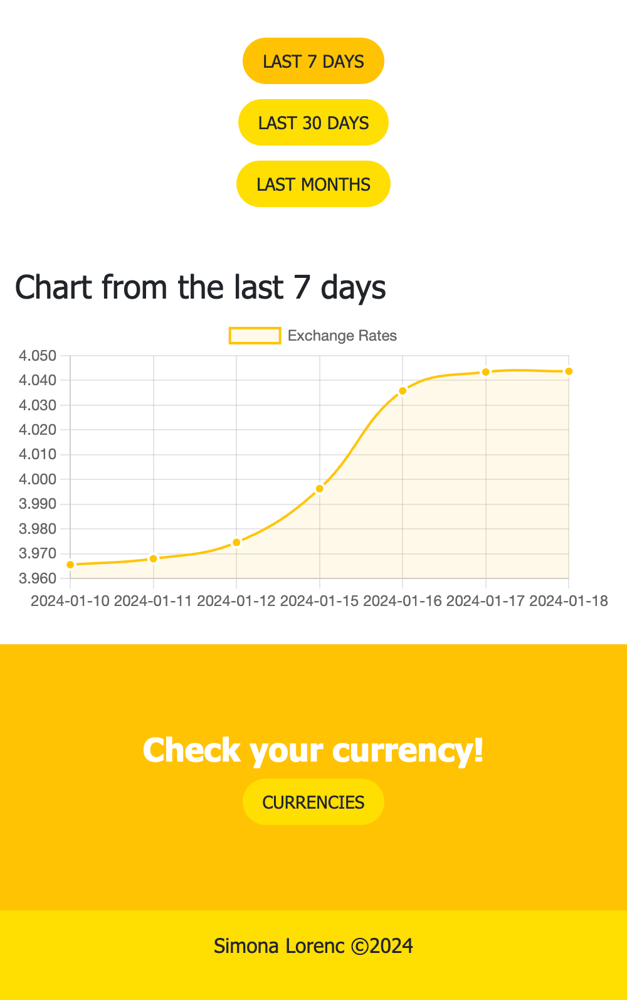

# Exchange Rates

See fluctuations in your currency using the tabel and charts below. Use fiter input to find Your currency!

This repository contains the source code of a web application that allows tracking current currency exchange rates and gold prices. The application provides users with detailed information about each currency, presenting the latest rates in a table and generating a chart of rate fluctuations. Users can add favorite currencies, saving them locally. The result of the project is a functional and interactive application for monitoring financial exchange rates.

Tech stack: 

- Angular
- TypeScript
- RxJS
- Bootstrap
- REST API
- HTML, SCSS

## Live

[Exchange-rate-app](https://65a9adb5afd6501be3ffbc22--wondrous-hotteok-16e8c4.netlify.app/#/dashboard/currency-list)

## Some screenshots:

    
        

## To do

- add a currency calculator